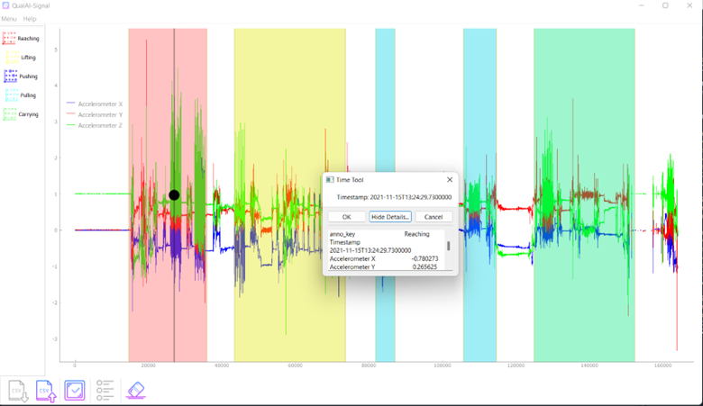

# Summary

Annotating wearble sensor data is an important step in human activity classification with wearable sensors. It enables users the ability to explore plots of sensor data and create up to 17 time-locked classifications. To date, there are limited annotation software available to classify activities in wearable sensor data (signaliner). 

# Statement of need

`QualAI-Signal` is a gui based annotation software that increases the speed and efficiency of classifying any variety of activities from wearable sensors at any step in the process (raw data, feature extraction, model prediction validation). 

`ParticleTracker` is a completely gui based particle tracking software
that implements and integrates a range of commonly needed tools to help users efficiently develop a wide range of different types of particle tracking projects.
Though the underlying code is written in python it can be used as stand alone executables, enabling those with little or no coding ability to make use of these tools. It is also algorithm agnostic providing a uniform interface to 3 commonly used approaches to tracking. It therefore provides an open source solution for new users to use particle tracking as a part of their research. At the same time the python code base is designed to make extending the project extremely simple. Extension
of each part of the code can be accomplished as simply as adding the project specific
code to a preconfigured template and adding a single python dictionary to a parameter file.

`ParticleTracker` was initially designed with the needs of masters students in mind who,
in semester long projects, want to quickly move beyond writing code to track different types of objects (bubbles, bacteria, colloids, granular particles etc)
and focus on the underlying science in their respective projects. Whilst the projects
are varied, some of the underlying tools needed are often the same, with some small element that is specific to each project. The combined needs of efficiently setting up a new tracking project, an intuitive common interface for different underlying algorithms, but with the ability to easily extend some small part of it has therefore guided our design philosophy. \autoref{fig:fig1} illustrates a few example tracking projects (a) diffusing colloids (b) jamming in birerefringent discs (c) classifying dividing bacteria, (d) swelling hydrogels, which with a little practise can be setup in a few minutes. However, as the software has developed it has become clear that the development speed, uniform interface to different underlying methods, and versatility of the project would also be useful for larger scale research projects. Especially since it can be used by those with or without significant coding experience.

# Acknowledgements

We acknowledge contributions from Nathan Smith in the early stages of this project. Mike Smith and James Downs acknowledge financial support from the Royal Society (UK).

# References
